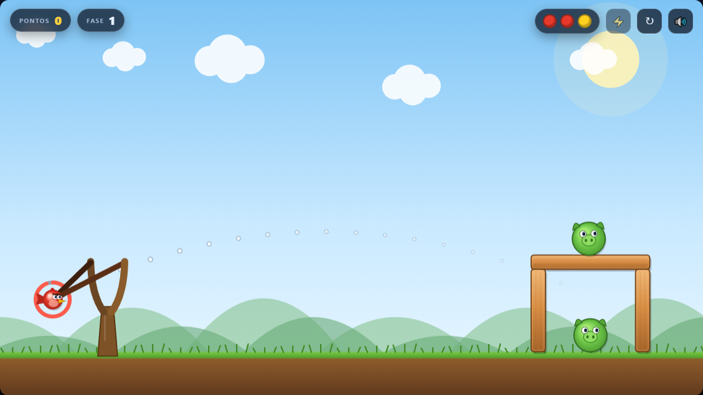
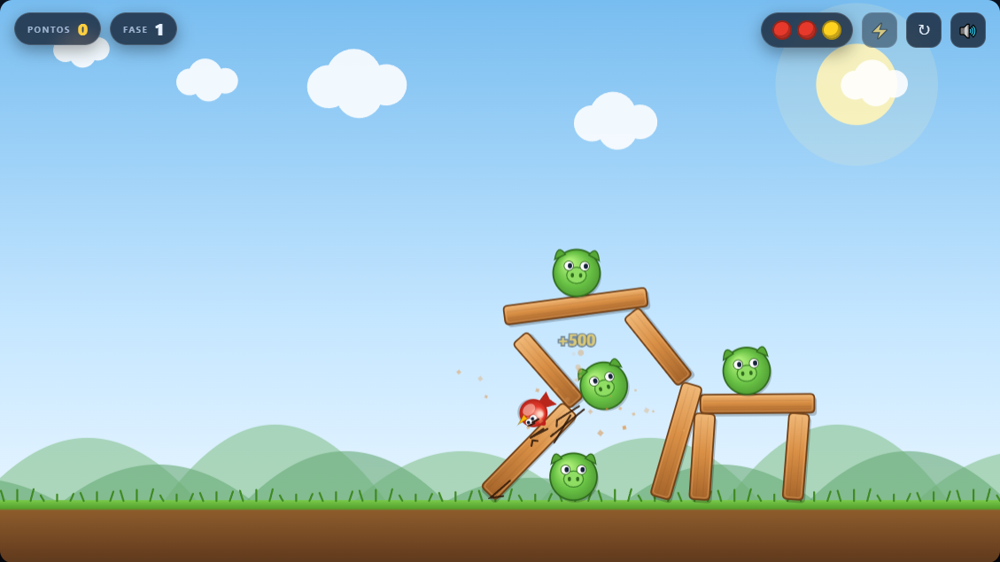
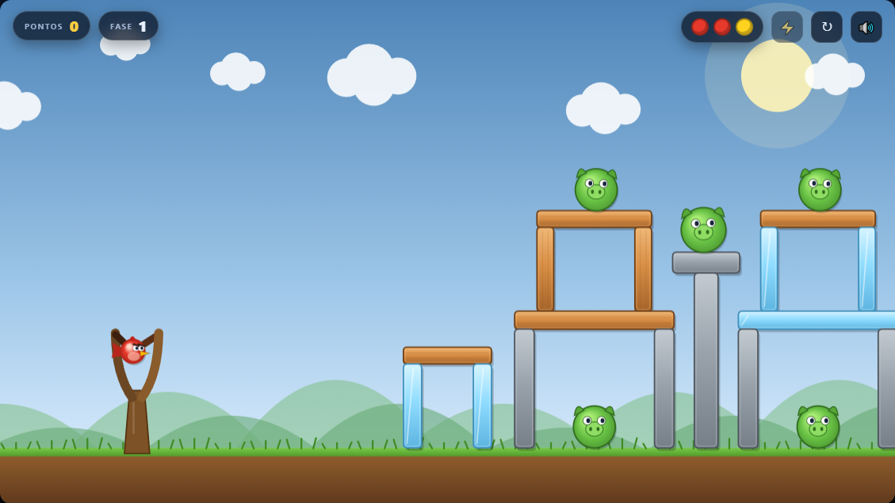
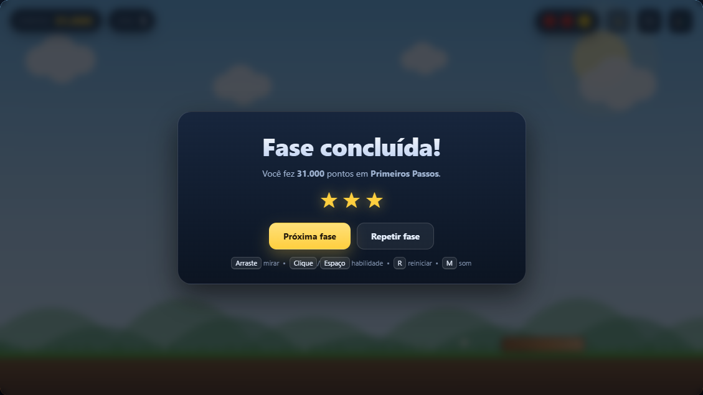
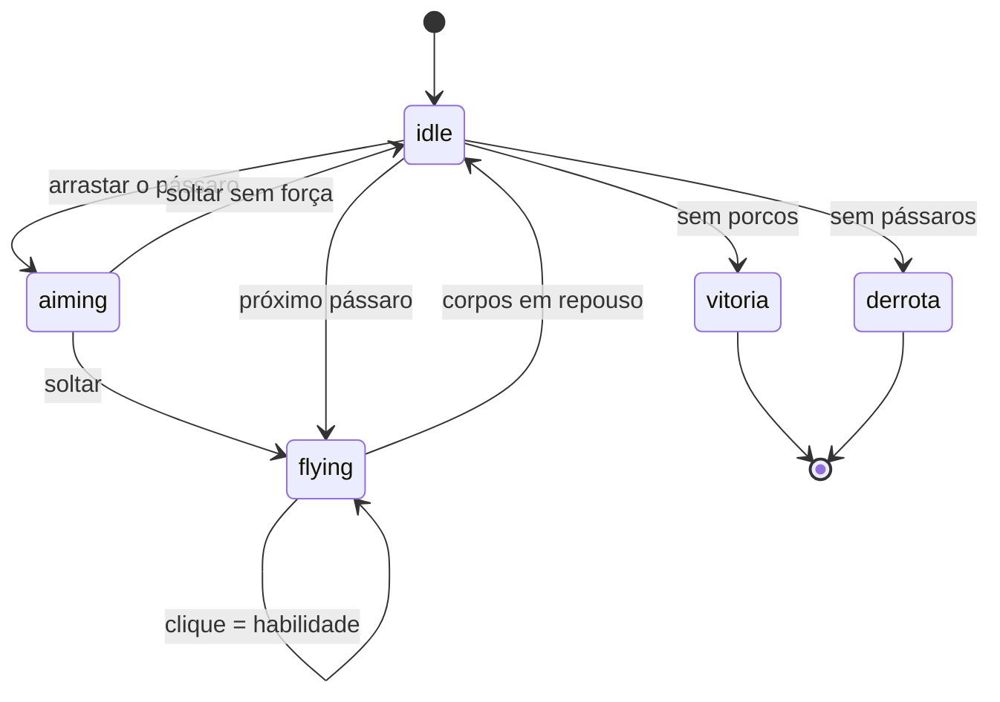

# 🐦 Angry Birds — Física & Som

Clone do Angry Birds feito com **HTML5 Canvas**, **física real** ([Matter.js](https://brm.io/matter-js/))
e **som 100% sintetizado** pela Web Audio API — sem nenhum arquivo de áudio externo.

### ▶️ [Jogar agora](https://mkazimoto.github.io/AngryBirdsCopilotDeepSeekV4/)

## 📸 Capturas de tela

| Mira com prévia da trajetória | Física em ação |
| :---: | :---: |
|  |  |
| **Castelo do Rei Porco** — fase 5 | **Vitória com 3 estrelas** |
|  |  |

```
index.html          página do jogo (abre direto no navegador)
vendor/matter.min.js motor de física (vendorizado — funciona offline)
css/style.css       HUD, overlay e botões
js/audio.js         síntese de todos os efeitos e da trilha sonora
js/entities.js      materiais, tipos de pássaro, fábricas e desenho
js/levels.js        as 5 fases
js/game.js          motor do jogo: física, dano, habilidades, câmera
js/main.js          interface, controles e loop de renderização
servidor.js         servidor estático local (opcional)
executar.bat        atalho: sobe o servidor e abre o navegador
```

---

## ▶️ Como jogar

**Opção 1 — abrir direto**

Dê duplo clique em `index.html`. Como os scripts são clássicos (sem ES modules) e o
Matter.js está local em `vendor/`, o jogo roda direto do disco, **sem internet**.

**Opção 2 — servidor local** (recomendado)

```bat
executar.bat
:: ou
node servidor.js        :: http://localhost:5173
```

---

## 🎮 Controles

| Ação | Teclado / Mouse |
| --- | --- |
| Mirar e lançar | **arraste** o pássaro para trás e **solte** |
| Habilidade da ave | **clique** / toque durante o voo — ou **Espaço** |
| Reiniciar fase | **R** |
| Ligar/desligar som | **M** |
| Confirmar no menu | **Enter** |

Durante a mira aparece a **prévia da trajetória** (simulada com a mesma gravidade do motor
de física) e um **arco de força** ao redor do pássaro.

---

## 🐤 As aves

| Pássaro | Habilidade | Como funciona |
| --- | --- | --- |
| **Red** (vermelho) | — | O clássico. Só força bruta. |
| **Chuck** (amarelo) | Impulso | Acelera de 21 para 34 px/passo na direção do voo. |
| **Jay** (azul) | Divisão | Vira 3 pássaros em leque (±0,24 rad), ideais contra gelo. |
| **Bomb** (preto) | Explosão | Explode no impacto forte ou ao ser acionado: raio de 190 px com dano e empurrão radiais. |

---

## 🧱 Materiais

Cada material tem densidade, vida (HP) e fragilidade próprios:

| Material | HP | Densidade | Comportamento |
| --- | --- | --- | --- |
| **Madeira** | 90 | 0,0012 | Quebra com um bom acerto direto. |
| **Pedra** | 190 | 0,0045 | Pesada e resistente; cede com acertos fortes, quedas ou explosão. |
| **Gelo** | 42 | 0,0008 | Estilhaça com qualquer impacto relevante. |

Os blocos mostram **rachaduras progressivas** conforme perdem vida.

---

## ⚙️ Como a física funciona

O núcleo está em `js/game.js`:

1. **Simulação em passo fixo** — o loop acumula o tempo real e roda
   `Matter.Engine.update(engine, 1000/60)`, garantindo comportamento idêntico
   em monitores de 60 Hz, 144 Hz ou com a aba lenta.
2. **Dano por energia de impacto** — em `collisionStart` calcula-se

   $$E = \tfrac{1}{2}\,\mu\,|\vec{v}_A - \vec{v}_B|^2,\qquad \mu = \frac{m_A m_B}{m_A + m_B}$$

   e o dano de um bloco é $E \times \text{fragilidade}$. Há um piso de energia
   (`MIN_ENERGY = 45`) para que o simples acomodamento das pilhas não destrua nada.
3. **Massa reduzida segura para estáticos** — o chão tem massa infinita, então
   $\mu$ é calculada à parte para evitar `Infinity / Infinity`.
4. **Atrito de rolamento** — círculos rolariam para sempre no Matter.js.
   Pássaros e porcos no chão sofrem amortecimento por passo e registram
   `groundTime`, usado para detectar o fim da jogada.
5. **Ações diferidas** — destruições e explosões disparadas de dentro de um
   callback de colisão entram numa fila e são executadas no passo seguinte,
   evitando mexer no mundo durante a iteração do motor.

### Fluxo de uma jogada



---

## 🔊 O áudio

Não existe um único `.mp3`. Tudo é gerado em tempo real em `js/audio.js`:

* **Ruído branco** em buffer, reaproveitado e filtrado (banda, passa-baixa,
  passa-alta) — base dos impactos e do whoosh do lançamento.
* **Osciladores** (`sine`, `triangle`, `sawtooth`, `square`) com envelopes
  exponenciais de ataque/queda.
* **Timbres por material** — madeira (médio, curto), pedra (grave, longo),
  gelo (agudo, cristalino), porco (grunhido), terra (surdo).
* **Limitação de taxa** — no máximo 3 sons por quadro e 45 ms entre impactos,
  para que um desabamento não vire uma metralhadora de ruído.
* **Trilha sonora** — sequenciador com *lookahead* de 250 ms sobre uma escala
  pentatônica (melodia + baixo + hi-hat), com ganho discreto e botão de mudo.
* O `AudioContext` só é ativado após o primeiro gesto do usuário, respeitando
  a política de autoplay dos navegadores.

---

## 🏆 Pontuação

| Evento | Pontos |
| --- | --- |
| Porco eliminado | 5 000 |
| Bloco destruído | 500 |
| Pássaro não utilizado (bônus de vitória) | 10 000 |

O total define de **1 a 3 estrelas**, conforme os limites de cada fase. As metas são
dimensionadas sobre o máximo possível de cada fase (porcos + blocos + bônus de aves
não usadas), de modo que **as 3 estrelas são sempre alcançáveis**, mas exigem poupar aves.

---

## 🗺️ Fases

| # | Nome | Porcos | Meta de ⭐⭐⭐ | Ideia |
| --- | --- | :---: | ---: | --- |
| 1 | Primeiros Passos | 2 | 30 000 | Estrutura em trave de gol; ensina a mecânica. |
| 2 | Cabana de Madeira | 4 | 44 000 | Torre de dois andares + abrigo lateral. |
| 3 | Torre de Gelo | 3 | 41 000 | Gelo estilhaça fácil; o pássaro azul se divide. |
| 4 | Muralha de Pedra | 4 | 48 000 | Muralha resistente — use as explosões. |
| 5 | Castelo do Rei Porco | 5 | 68 000 | Fortaleza final: duas alas, torre central e anteparo de gelo. |

---

## 🛠️ Detalhes de implementação

* **Renderização própria** com Canvas 2D (o renderizador do Matter.js não é usado):
  gradientes, brilhos, veios de madeira, rachaduras determinísticas por `id` do corpo,
  sombras e animações (piscada dos porcos, brilho da habilidade disponível).
* **Paralaxe** em três planos — céu com sol, nuvens em movimento e colinas —
  além de tremor de tela proporcional ao impacto.
* **Partículas e textos flutuantes** para detritos, poeira, fumaça e pontuação.
* **Câmera** que acompanha o pássaro em voo e volta suavemente ao estilingue.
* **Responsivo** — o canvas 16:9 se adapta à janela, com `devicePixelRatio` para
  nitidez em telas de alta densidade.
* Escala do mundo: 1280×720 de viewport, gravidade efetiva de **0,3194 px/passo²**
  e lançamento máximo de **21 px/passo**.

---

## 📄 Créditos

Projeto de estudo. Angry Birds é uma marca da Rovio Entertainment; este clone não
tem vínculo com a empresa e usa apenas arte gerada em código.
Física por [Matter.js](https://github.com/liabru/matter-js) (MIT).
